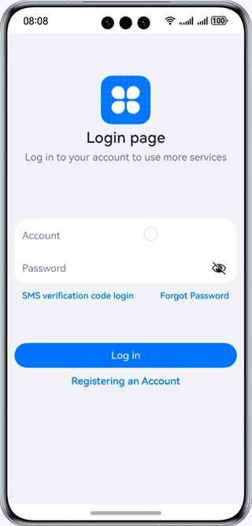

# Efficient Development with DevEco Studio

### Introduction

This codelab introduces how to use DevEco Studio to efficiently develop the login app. Example:

### Concepts

- UI preview: DevEco Studio lets you preview the UI of your code while editing it.
- Running your app/service on a local real device: The method is same regardless whether you run your HarmonyOS app/service on a phone or tablet. You can use a USB connection or a TCP connection.
- Debugging your app on a real device: DevEco Studio provides various debugging capabilities for HarmonyOS apps/services, including single-language debugging (JS, ArkTS, and C/C++) and cross-language debugging (ArkTS, JS+C, and C++).
- Test framework: DevEco Studio supports the app/service test framework, with basic APIs for writing test cases and the capability to execute test cases, output test results, and provide the code coverage. It helps you develop simple and easy-to-use automatic test scripts.

### Permissions

N/A

### How to Use

1. Open the app to access the login page.
2. Enter your account and password (any character) and tap **Log In** to access the app home page.
3. Press the tabs at the bottom to switch between **Home** and **Me**.
4. On the **Me** tab page, tap **Log Out** to return to the login page.

### Constraints

1. The sample is only supported on Huawei phones with standard systems.
2. HarmonyOS: HarmonyOS NEXT Developer Beta1 or later.
3. DevEco Studio: DevEco Studio NEXT Developer Beta1 or later.
4. HarmonyOS SDK: HarmonyOS NEXT Developer Beta1 SDK or later.
